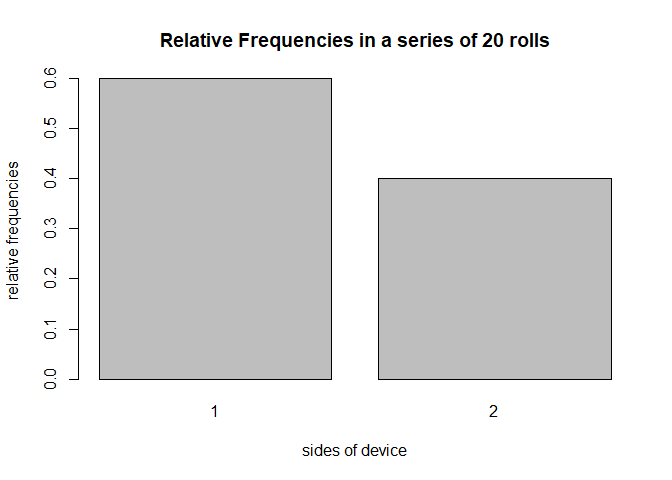

<!-- README.md is generated from README.Rmd. Please edit that file -->
Overview
--------

The package '"roller"' is package for simulating rolling a device a given number of times. One can create own device with customized sides and probability, and can simulate rolling for desired number of times. Visualization of rolls is also available.

-   'device()' creates a device to roll (of class 'device')
-   'roll()' roll the device object, produces class of 'roll'
-   'plot()' plot method for 'roll' objects to draw barchart of roll results
-   'summary()' method for 'roll' object

Motivation
----------

This package is for simulating rolling a customized device

Installation
------------

``` r
# development version from GitHub:
#install.packages("devtools") 
# install "roller" (without vignettes)
devtools::install_github("hw-stat133-duilee/roller")
# install "roller" (with vignettes)
devtools::install_github("hw-stat133-duilee/roller", build_vignettes = TRUE)
```

Usage
-----

``` r
library(roller)

# default device
device1 <- device()
device1
#> object "device"
#> 
#>   side prob
#> 1    1  0.5
#> 2    2  0.5

# roll the device(default time = 1)
roll20 <- roll(device1, 20)
roll20
#> object "rolls"
#> 
#>  [1] 2 1 2 1 2 1 2 2 2 2 1 2 1 1 1 1 1 1 1 1

#summary
summary(roll20)
#> summary "rolls"
#> 
#>   side count prop
#> 1    1    12  0.6
#> 2    2     8  0.4

#add ten more toss
roll20 + 10
#> object "rolls"
#> 
#>  [1] 2 1 2 1 2 1 2 2 2 2 1 2 1 1 1 1 1 1 1 1 1 1 2 1 1 2 1 2 1 1

#plot rolls
plot(roll20)
```


