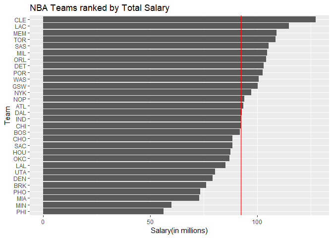
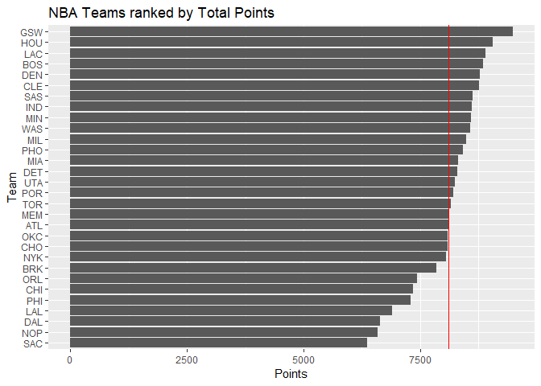
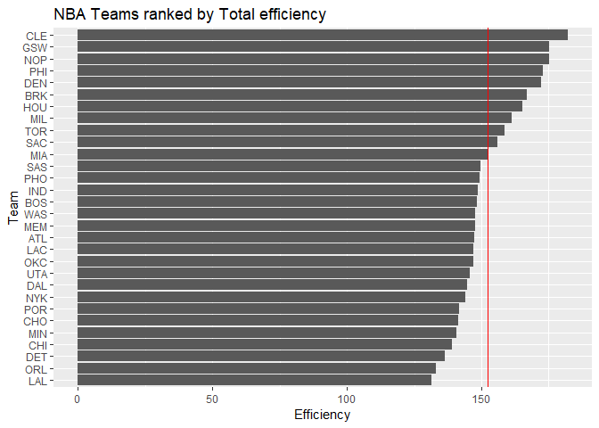
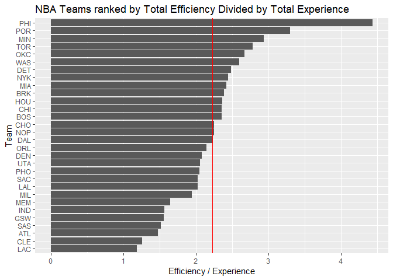

Ranking of Teams
----------------

    library(readr)
    library(dplyr)

    ## 
    ## Attaching package: 'dplyr'

    ## The following objects are masked from 'package:stats':
    ## 
    ##     filter, lag

    ## The following objects are masked from 'package:base':
    ## 
    ##     intersect, setdiff, setequal, union

    library(ggplot2)

    nbateams = read_csv('../data/nba2018-teams.csv')

    ## Warning: Missing column names filled in: 'X1' [1]

    ## Parsed with column specification:
    ## cols(
    ##   X1 = col_integer(),
    ##   team = col_character(),
    ##   experience = col_integer(),
    ##   salary = col_double(),
    ##   points3 = col_integer(),
    ##   points2 = col_integer(),
    ##   points1 = col_integer(),
    ##   points = col_integer(),
    ##   off_rebounds = col_integer(),
    ##   def_rebounds = col_integer(),
    ##   assists = col_integer(),
    ##   steals = col_integer(),
    ##   blocks = col_integer(),
    ##   turnovers = col_integer(),
    ##   fouls = col_integer(),
    ##   efficiency = col_double()
    ## )

### Basic Rankings

#### ranking the teams according to salary, arranged in decreasing order. Vertical line indicates the average salary.

    nbateams <- arrange(nbateams, desc(salary))
    ggplot(nbateams, aes(x = reorder(team, salary), y = salary)) + geom_bar(stat='identity') + coord_flip() +
      geom_hline(yintercept = mean(nbateams$salary), color = 'red') +
      labs(title = 'NBA Teams ranked by Total Salary', x = 'Team', y = 'Salary(in millions)')

#### Create another bar chart of teams ranked by total points. Vertical line indicating the average team points.

    ggplot(nbateams, aes(x = reorder(team, points), y = points)) + geom_bar(stat='identity') + coord_flip() +
      geom_hline(yintercept = mean(nbateams$points), color = 'red') +
      labs(title = 'NBA Teams ranked by Total Points', x = 'Team', y = 'Points')

#### Use efficiency to obtain a ranking, and create an associated bar chart of teams ranked by total efficiency. Vertical line indicates the average team efficiency.

    ggplot(nbateams, aes(x = reorder(team, efficiency), y = efficiency)) + geom_bar(stat='identity') + coord_flip() +
      geom_hline(yintercept = mean(nbateams$efficiency), color = 'red') +
      labs(title = 'NBA Teams ranked by Total efficiency', x = 'Team', y = 'Efficiency')

#### Create a fourth bar chart but this time using your own index.

-   I have used the index 'efficiency / experience'. One of the criteria
    of ranking team can be looking at how much total efficiency of the
    players that each team is getting with respect to player's total
    experience. With a same amount of experience, the team with higher
    efficiency can be treated as a better team. Hence, we can compare
    the ratio of efficiency and experience by dividing efficiency with
    experience, and get the comparison over different teams.

-   Graph follows as below

<!-- -->

    new_index <- nbateams %>% mutate(eff_per_ex = efficiency / experience)
    ggplot(new_index, aes(x = reorder(team, eff_per_ex), y = eff_per_ex)) + geom_bar(stat='identity') + coord_flip() +
      geom_hline(yintercept = mean(new_index$eff_per_ex), color = 'red') +
      labs(title = 'NBA Teams ranked by Total Efficiency Divided by Total Experience', x = 'Team', y = 'Efficiency / Experience')

Comments and Reflections
------------------------

-   It was my first time working on a project with such file structure.
    I do feel that it is an organized to way work through a project, and
    will be definitely useful in the future. Yet the practice do require
    time and effort.
-   It was not my first time using relative paths, but it was good
    refresher
-   It was my first time using an R script. I was lagging a little bit
    as I was commenting and typing in codes with out inserting R chunk.
    But I got used to it.
-   I think ggplot was quite hard as it used more layers like adding
    vertical line and ordering the y axis.
-   Working with dplyr was on the easier side as it is quite logical to
    follow
-   I consulted a lot of Piazza, class material and google search
-   It took be 6~7 hours, with setting data dictionary and ggplot taking
    the most amount of time.
-   manipulating the data into the way I want to present is definitely
    interesting.
