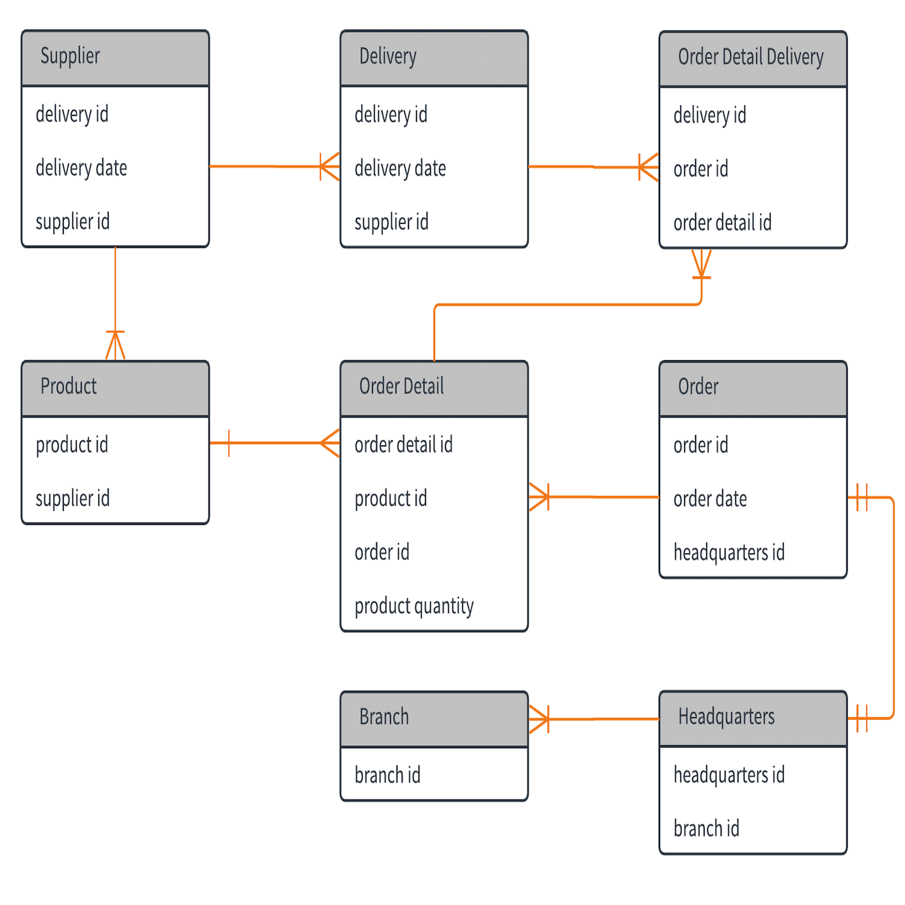

## SQL notes
### _**Data Query Lanaguage**_
- SELECT
	>SELECT * // column name or names seperated by comma  
	FROM customers 
- LIMIT
	>SELECT * // column name or names seperated by comma  
	FROM customers   
	LIMIT 2 // show only two  == HEAD(2)
- WHERE
	>SELECT * // column name or names seperated by comma  
	FROM customers   
	WHERE CONDITION // i.e. columnname = 'some string'  
	&nbsp;&nbsp;&nbsp;&nbsp;&nbsp;&nbsp;&nbsp;&nbsp;&nbsp;&nbsp;&nbsp;&nbsp;&nbsp;&nbsp;&nbsp;&nbsp;&nbsp;&nbsp;// COND OR/AND COND  
	&nbsp;&nbsp;&nbsp;&nbsp;&nbsp;&nbsp;&nbsp;&nbsp;&nbsp;&nbsp;&nbsp;&nbsp;&nbsp;&nbsp;&nbsp;&nbsp;&nbsp;&nbsp;// =, <>, <=, >=  
	LIMIT 2 // show only two  == HEAD(2)
- LIKE
	>WHERE columnname LIKE 'br%' // % any string after, _ wildcard for one character  
	&nbsp;&nbsp;&nbsp;&nbsp;&nbsp;&nbsp;&nbsp;&nbsp;&nbsp;&nbsp;&nbsp;&nbsp;&nbsp;&nbsp;&nbsp;&nbsp;&nbsp;&nbsp;// RLIKE to use regular expression  
	 WHERE columnname IN ('Germany', 'France')  
	 WHERE columnname BETWEEN a AND b  
	 WHERE columnname IS NULL  
- DISTINCT
	> SELECT DISTINCT(columname)
- ORDER BY
	> ORDER BY columnname  DESC/ASC(default)
- SUBSTR, LEFT, RIGHT
	> SUBSTR(columnname, start_position, length)  
	LEFT(columnname, length) // from left  
	RIGHT(columnname, length) // from right  
- Decimal control
	> CEIL() // CEIL(3.3) => 4  
	FLOOR() // FLOOR(3.6) => 3  
	ROUND(number, digits) // ROUND(3.142592, 2) => 3.14

- Aggregation
	>COUNT(colmnname) // count except NULL, COUNT(*) => count all  
	COUNT(DISTINCT columnname) // to count distinct values  
	SUM, AVG, MIN, MAX

- GROUP BY
	>SELECT *   
	FROM customers  
	GROUP BY reference_column // can also have multiple columns  
	HAVING condition // after GROUP BY use HAVING instead of WHERE  
- AS (Use as to add short call name)
- CASE
	> SELECT CASE  
		&nbsp;&nbsp;&nbsp;&nbsp;&nbsp;&nbsp; WHEN condition THEN sth // add desired result here  
		&nbsp;&nbsp;&nbsp;&nbsp;&nbsp;&nbsp; WHEN condition THEN sth  
		&nbsp;&nbsp;&nbsp;&nbsp;&nbsp;&nbsp; ...  
		&nbsp;&nbsp;&nbsp;&nbsp;&nbsp;&nbsp; END  
- JOIN, INNER JOIN, OUTER LEFT/RIGHT JOIN
	>SELECT *  
	FROM customers  
	INNTER JOIN datatable_name ON condition // RIGHT JOIN or LEFT JOIN also possible  
- UNION
	>SELECT *  
	FROM customers 2  
	UNION  
	SELECT *  
	FROM cusomers 1  
	// ORDER BY should always come at the last  
	// UNION takes distinct values only, so use UNION ALL to include all  
- DATE functions
	> DATE_ADD() // for addition  
	DATE_SUB() // for subtration  
	DATE() // get the date only, HOUR, DAY, YEAR, MONTH all available
	
### _**Data Manipulation Language**_
- INSERT
	> INSERT INTO table_name VALUES (value_list);
	INSERT INTO table_name (column_list) VALUES (value_list);
- UPDATE
	> UPDATE table_name SET column = value;
	UPDATE table_name SET column = value WHERE cond;
- DELETE 
	> DELETE FROM table_name WHERE cond

### _**SubQuery**_
- SubQuery uses queried result within new query
	> SELECT sub.column_name  
	, AVG(sub.column_name)  
	FROM(  
	&nbsp;&nbsp;&nbsp;&nbsp;&nbsp;&nbsp;&nbsp;&nbsp;&nbsp;&nbsp;SELECT colum_name  
	&nbsp;&nbsp;&nbsp;&nbsp;&nbsp;&nbsp;&nbsp;&nbsp;&nbsp;&nbsp;FROM original_table  
	&nbsp;&nbsp;&nbsp;&nbsp;&nbsp;&nbsp;&nbsp;&nbsp;&nbsp;&nbsp;GROUP BY column_name, column_name  
	&nbsp;&nbsp;&nbsp;&nbsp;&nbsp;&nbsp;&nbsp;&nbsp;&nbsp;&nbsp;) sub  
	WHERE ..  
	GROUP BY ...  
	> WHERE column_name = (SELECT MIN(column_name) FROM table)  
	WHERE column_name IN (SELECT column_name FROM table ORDER BY column_name DESC LIMIT 5)  
	
### _**ERD(Element Relationship Diagram)**_
- Consists of Entity, Attribute, and Relationship
	>   
	> -l-l-  = ONE  
	o<- = Many
	
### _**Data Type**_
- Integer : tinyint(), smallint(), mediumint(), int(), bigint()  
float: decimal(), double(), float()  
- chracter: varchar(), char()
- string to datetime: str_to_date()

### _**With Statment**_
- Use with for repetitive use of query
	> WITH subquery AS (  
	&nbsp;&nbsp;&nbsp;&nbsp;&nbsp;&nbsp;&nbsp;&nbsp;&nbsp;&nbsp; SELECT ...  
	&nbsp;&nbsp;&nbsp;&nbsp;&nbsp;&nbsp;&nbsp;&nbsp;&nbsp;&nbsp; FROM ...  
	&nbsp;&nbsp;&nbsp;&nbsp;&nbsp;&nbsp;&nbsp;&nbsp;&nbsp;&nbsp; ...  
	
### _**Window Function**_
- windon functions include SUM, AVG, COUNT, ROW_NUMBER(), RANK(), DENSE_RANK()
	> Function(column) OVER (PARTITION BY column_name ORDER BY column_name)
- LEAD(column_name, step, null_value) OVER (ORDER BY column_name) AS 'alias'; // move one up  
  LAG() // move one down

### _**REGEXP**_
- https://regexr.com/
- https://regexone.com/lesson/introduction_abcs

### _**MySQL Function**_
- FORMAT goes...
	> CREATE FUNCTION 'function name' ('parameter_name', 'datatype')  
	RETURN 'datatype' (DETERMINISTIC) // to get consistant output for same input  
	BEGIN  
	&nbsp;&nbsp;&nbsp;&nbsp;&nbsp;&nbsp;&nbsp;&nbsp;&nbsp;&nbsp; DECLARE 'variable name' 'datatype'  
	&nbsp;&nbsp;&nbsp;&nbsp;&nbsp;&nbsp;&nbsp;&nbsp;&nbsp;&nbsp; SET ;  
	&nbsp;&nbsp;&nbsp;&nbsp;&nbsp;&nbsp;&nbsp;&nbsp;&nbsp;&nbsp; RETURN (variable name)  
	END  

### _**If Statment**_
- if statement goes ...
	> IF (condition, value if True, value if False)

### _**More LIMIT**_
- more LIMIT usage!
	> LIMIT 5, 10 //row from 6~15  
	LIMIT 5, 1 // row 6  
	LIMIT N, 1 // row n+1  
	LIMIT 1 OFFSET N // row n+1  

### _**NOTES**_
> **For just a join, use right after the FROM phrase**  
FROM ( SELECT ~~  
	FROM ~~  
	GROUP BY ~~  
	) t INNER JOIN some_table ON some_index = some_index

> **Set multiple conditions on ORDER BY by specifying which order to sort by after the column name**  
ORDER BY some_column1 DESC, some_column2 ASC

> **Can't perform group by and join on the same sub query**

> **SELECT SubQuery is useful**  
SELECT c.company_code, c.founder,  
       (SELECT COUNT(DISTINCT(lead_manager_code))  
        FROM lead_manager  
        WHERE company_code = c.company_code),  
       (SELECT COUNT(DISTINCT(senior_manager_code))  
        FROM senior_manager  
        WHERE company_code = c.company_code),  
FROM company AS c  
ORDER BY c.company_code  

> **CASE LINE can be use full when needed**, aggregate function can be anything for below  
SELECT  
      MIN(CASE WHEN occupation = "Doctor" THEN name ELSE NULL END) doctor,  
      MIN(CASE WHEN occupation = "Professor" THEN name ELSE NULL END) professor,  
      MIN(CASE WHEN occupation = "Singer" THEN name ELSE NULL END) singer,  
      MIN(CASE WHEN occupation = "Actor" THEN name ELSE NULL END) actor    
FROM(SELECT  
          occupation,  
          name,  
          ROW_NUMBER() OVER (PARTITION BY occupation ORDER by name) AS rn  
    FROM occupations) t  
GROUP BY rn  
ORDER BY rn  

> **also utilize multiple queries to output multiple rows**  
SELECT city  
     , LENGTH(city) AS len_city  
FROM station  
ORDER BY len_city, city  
LIMIT 1;  
SELECT city  
     , LENGTH(city) AS len_city  
FROM station  
ORDER BY len_city DESC, city  
LIMIT 1   

> **Subquery with in select or case phrase**  
SELECT N,  
     CASE  
         WHEN P IS NULL THEN "Root"  
         WHEN N IN (SELECT DISTINCT P FROM bst) THEN "Inner"  
         ELSE "Leaf"  
     END  
FROM bst  
ORDER BY N  

> **Using two queries with INNER JOIN** check ROW_NUMBER() OVER function   
SELECT start_date, end_date  
FROM(      
    SELECT start_date  
         , ROW_NUMBER() OVER (ORDER BY start_date) rnk  
    FROM Projects  
    WHERE start_date NOT IN (SELECT DISTINCT end_date FROM Projects)  
) s_data  
 INNER JOIN (  
 SELECT end_date  
         , ROW_NUMBER() OVER (ORDER BY end_date) rnk  
    FROM Projects  
    WHERE end_date NOT IN (SELECT DISTINCT start_date FROM Projects)  
 ) e_data ON s_data.rnk = e_data.rnk  
ORDER BY DATEDIFF(end_date, start_date), start_date  

> **ROW NUMBER() OVER (PARTITION BY) is the key...**  
SELECT id  
     , age  
     , coins_needed 
     , power  
FROM(  
    SELECT w.id  
         , wp.age  
         , w.coins_needed  
         , w.power  
         , ROW_NUMBER() OVER (PARTITION BY w.code, w.power ORDER BY coins_needed) rn  
    FROM Wands w  
    LEFT JOIN Wands_Property wp on w.code = wp.code  
    WHERE wp.is_evil = 0  
) t  
WHERE rn = 1  
ORDER BY power DESC, age DESC  

> **Using regexp in SQL**  
SELECT DISTINCT CITY  
FROM STATION  
WHERE CITY REGEXP '^[^aeiou]|[^aeiou]$'  

> **Finding Median in SQL**
SELECT ROUND(AVG(LAT_N), 4)  
FROM (  
    SELECT ROW_NUMBER() OVER (ORDER BY LAT_N) row_num  
         , COUNT(*) OVER () n  
         , LAT_N  
    FROM Station  
) t  
WHERE CASE  
            WHEN MOD(n, 2) = 1 THEN row_num = (n+1)/2  
            ELSE row_num IN (n/2, (n/2)+1)  
      END  
> ** Same Problem with Percent rank**
SELECT ROUND(AVG(LAT_N), 4)  
FROM(  
      SELECT LAT_N  
           , PERCENT_RANK() OVER (ORDER BY LAT_N) p_rn  
      FROM Station  
)t  
WHERE p_rn = 0.5  

> **Using DENSE_RANK()**  
SELECT Score  
     , DENSE_RANK() OVER (ORDER BY Score DESC) AS 'Rank'  
FROM Scores  
ORDER BY Score DESC  

> **https://leetcode.com/problems/trips-and-users**  
SELECT request_at AS Day  
     , ROUND(cancel_count / total_count, 2) AS 'Cancellation Rate'  
FROM (SELECT request_at  
         , SUM(CASE WHEN t.status != "completed" THEN 1 ELSE 0 END) cancel_count  
         , COUNT(*) total_count  
    FROM trips t  
        INNER JOIN users uc ON t.client_id = uc.users_id  
        INNER JOIN users ud ON t.driver_id = ud.users_id  
    WHERE uc.Banned = "No" AND ud.Banned = "No" AND t.request_at BETWEEN "2013-10-01" AND "2013-10-03"  
    GROUP BY request_at) t  
    
> **https://leetcode.com/problems/exchange-seats**  
SELECT (CASE  
            WHEN id % 2 = 1 AND id != total_count THEN id + 1  
            WHEN id % 2 = 1 AND id = total_count THEN id  
            ELSE id-1 END  
       ) AS id,  
       student  
FROM (SELECT id  
           , student  
           , COUNT(*) OVER () AS total_count  
      FROM seat) t  
ORDER BY id  

> **Another partition problem...**
SELECT d.Name AS "Department"  
     , t.Employee  
     , t.Salary  
FROM (SELECT DENSE_RANK() OVER (PARTITION BY DepartmentId ORDER BY Salary DESC) 'rank'  
           , Name as 'Employee'  
           , Salary  
           , DepartmentID  
      FROM Employee) t  
INNER JOIN Department d on t.DepartmentId = d.Id  
WHERE t.rank = 1  

> **LEAD FUNCTION**  
SELECT DISTINCT t.first AS 'ConsecutiveNums'  
FROM (SELECT num AS 'first'  
           , LEAD(num, 1) OVER (ORDER BY id) AS 'second'  
           , LEAD(num, 2) OVER (ORDER BY id) AS 'third'  
      FROM Logs) t   
WHERE t.first = t.second AND t.second = t.third  

> **SQL Function + another dense rank...**
CREATE FUNCTION getNthHighestSalary(N INT) RETURNS INT  
BEGIN  
  RETURN (  
      # Write your MySQL query statement below.  
      SELECT DISTINCT Salary  
      FROM (SELECT DENSE_RANK() OVER (ORDER BY Salary DESC) AS 'Rank'  
                 , Salary  
              FROM Employee) t   
      WHERE t.Rank = N  
  );  
END  
